<!--
lab:
  title: ' Use Case 05: Implementing a Data Science scenario in Microsoft Fabric'
  description: In this lab, you’ll assume the role of a data engineer at Contoso tasked with designing and implementing a data warehouse solution using Microsoft Fabric. You will start by setting up a Fabric workspace, creating a data warehouse, loading data from Azure Blob Storage, and performing analytical tasks to deliver insights to Contoso's decision-makers.
  duration: 5 minutes
  level: 400
  islab: true
  primarytopics:
    - Azure
    - Azure Blob Storage
    - Microsoft Fabric
-->

# Use Case 05: Implementing a Data Science scenario in Microsoft Fabric

**Introduction**

The lifecycle of a Data science project typically includes (often,
iteratively) the following steps:

- Business understanding

- Data acquisition

- Data exploration, cleansing, preparation, and visualization

- Model training and experiment tracking

- Model scoring and generating insights

The goals and success criteria of each stage depend on collaboration,
data sharing and documentation. The Fabric data science experience
consists of multiple native-built features that enable collaboration,
data acquisition, sharing, and consumption in a seamless way.

In these tutorials, you take the role of a data scientist who has been
given the task to explore, clean, and transform a dataset containing the
churn status of 10000 customers at a bank. You then build a machine
learning model to predict which bank customers are likely to leave.

**Objective**

- Use the Fabric notebooks for data science scenarios.

- Ingest data into a Fabric lakehouse using Apache Spark.

- Load existing data from the lakehouse delta tables.

- Clean and transform data using Apache Spark and Python based tools.

- Create experiments and runs to train different machine learning
  models.

- Register and track trained models using MLflow and the Fabric UI.

- Run scoring at scale and save predictions and inference results to the
  lakehouse.

- Visualize predictions in Power BI using DirectLake.

## Task 1: Create a workspace

Before working with data in Fabric, create a workspace.

1.  Open your browser, navigate to the address bar, and type or paste
    the following URL: +++https://app.fabric.microsoft.com/+++ then
    press the **Enter** button.

\[!Note\] If you are directed to Microsoft Fabric Home page, then skip
steps from \#2 to \#4.


2.  In the **Microsoft Fabric** window, enter your credentials, and
    click on the **Submit** button.


3.  Then, In the **Microsoft** window enter the password and click on
    the **Sign in** button.


4.  In **Stay signed in?** window, click on the **Yes** button.

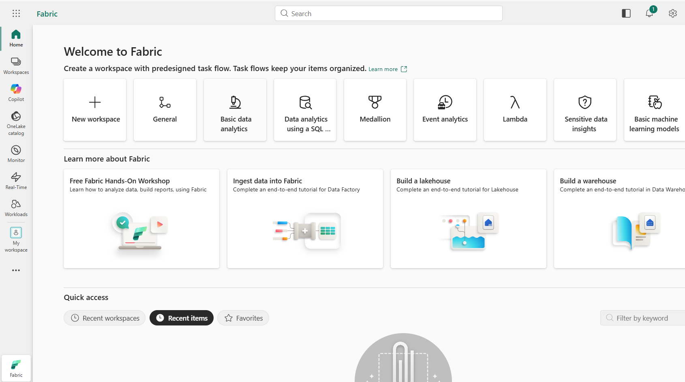

5.  In the **Fabric** home page, select **+New workspace**.

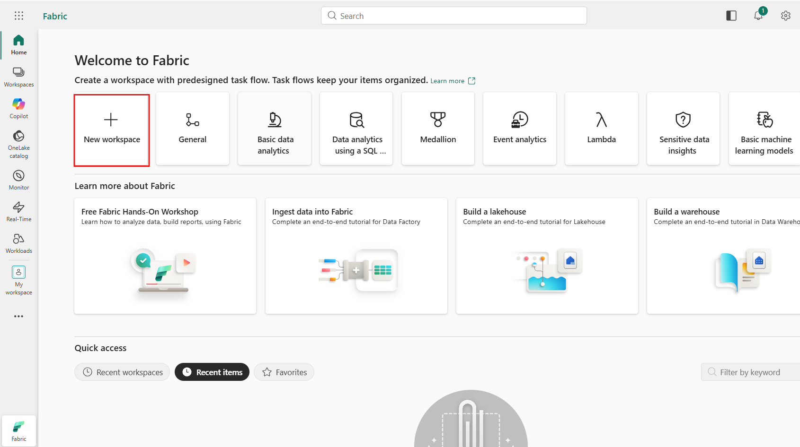

6.  In the **Create a workspace tab**, enter the following details and
    click on the **Apply** button.

| Property | Value |
| --- | --- |
| Name | +++Data-Science@lab.LabInstance.Id+++ |
| Advanced | Under **License mode**, select **Fabric capacity** |
| Semantic model storage format | **Small semantic model storage format** |

> 
>
> 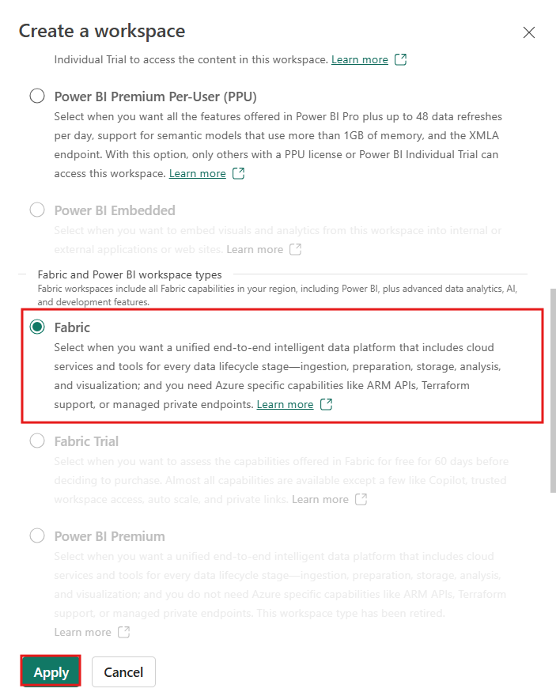

7.  Wait for the deployment to complete. It takes 2-3 minutes to
    complete. When your new workspace opens, it should be empty.

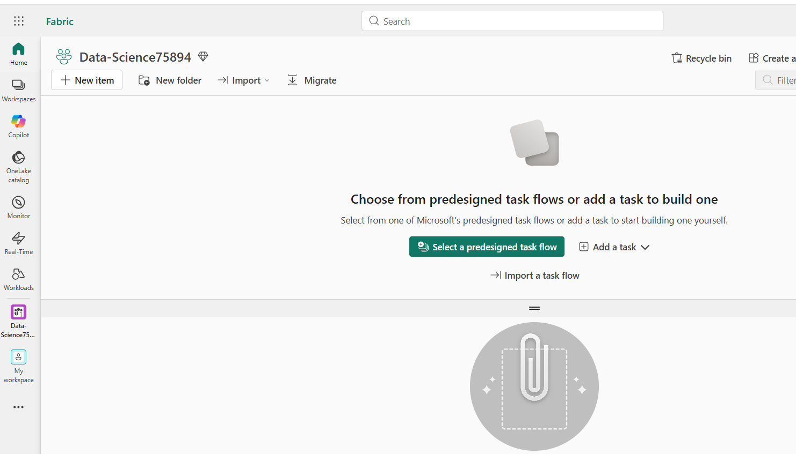

## Task 2: Create a lakehouse

Now that you have a workspace, it's time to switch to the *Data
engineering* experience in the portal and create a data lakehouse for
the data files you're going to analyze.

1.  In the Fabric home page, Select **+New item** and filter by, and
    select, +++Lakehouse+++

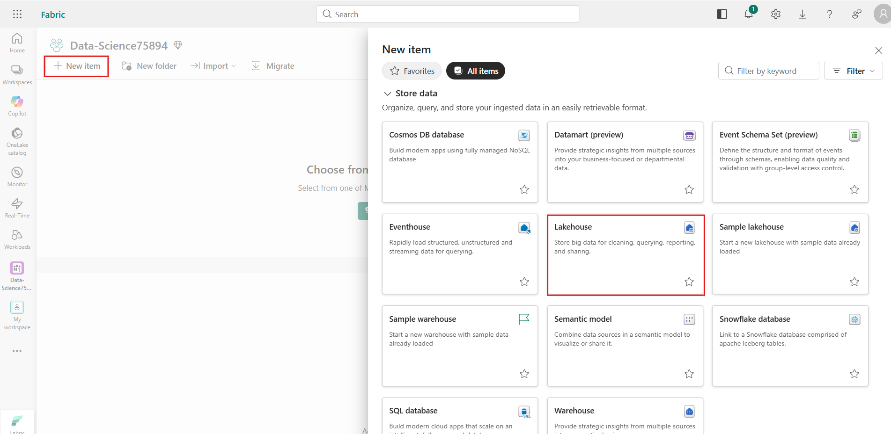

2.  In the **New lakehouse** dialog box, enter
    +++**FabricData_Sciencelakehouse**+++ in the **Name** field, click
    on the **Create** button and open the new lakehouse.

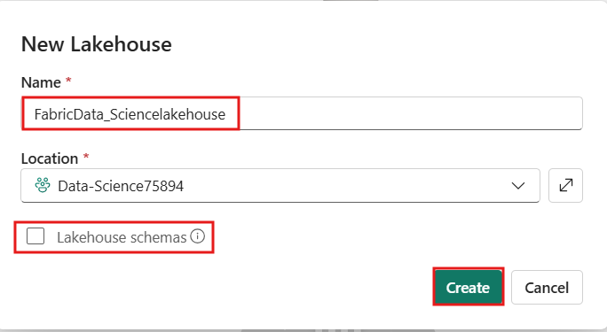

\[!Note\] After a minute or so, a new empty lakehouse will be created.
You need to ingest some data into the data lakehouse for analysis.

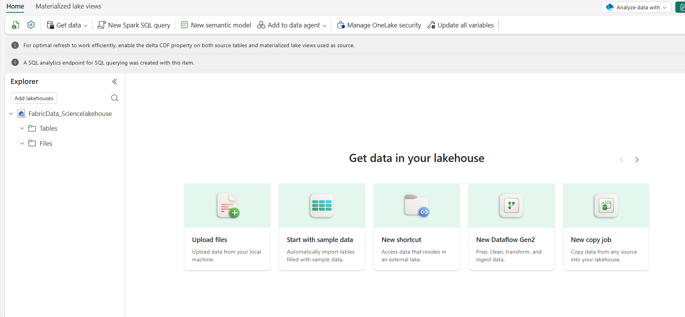

\[!Note\] You will see a notification stating **Successfully created SQL
endpoint**.


## Task 3: Install custom libraries and load the data

**Bank churn data**

The dataset contains churn status of 10,000 customers. It also includes
attributes that could impact churn such as:

- Credit score

- Geographical location (Germany, France, Spain)

- Gender (male, female)

- Age

- Tenure (years of being bank's customer)

- Account balance

- Estimated salary

- Number of products that a customer has purchased through the bank

- Credit card status (whether a customer has a credit card or not)

- Active member status (whether an active bank's customer or not)

The dataset also includes columns such as row number, customer ID, and
customer surname that should have no impact on customer's decision to
leave the bank.

The event that defines the customer's churn is the closing of the
customer's bank account. The column exited in the dataset refers to
customer's abandonment. There isn't much context available about these
attributes so you have to proceed without having background information
about the dataset. The aim is to understand how these attributes
contribute to the exited status.

1.  From the toolbar, select the **Analyze data** **with** drop-down
    menu, point to **Notebook**, and then select **New notebook**.

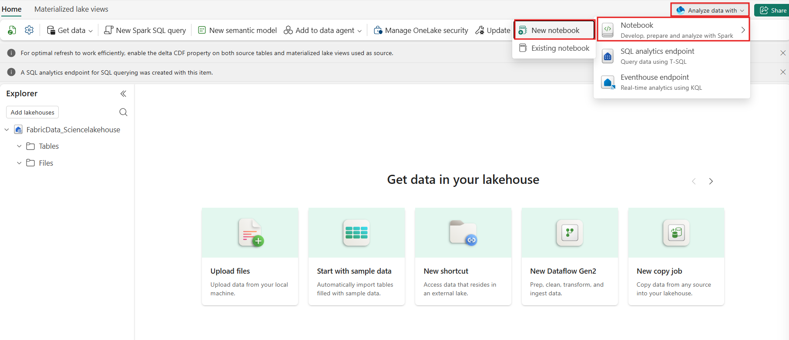

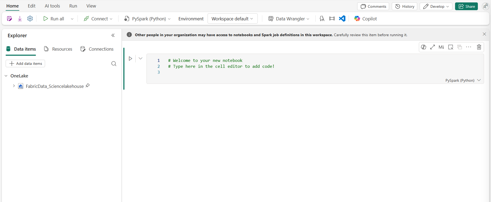

2.  Enter the following code. This code use %pip install to install the
    imblearn library and then stores it in a Fabric lakehouse. Select
    the code cell and click on the **play** button to execute cell.

```
# Use pip to install libraries
%pip install imblearn
```

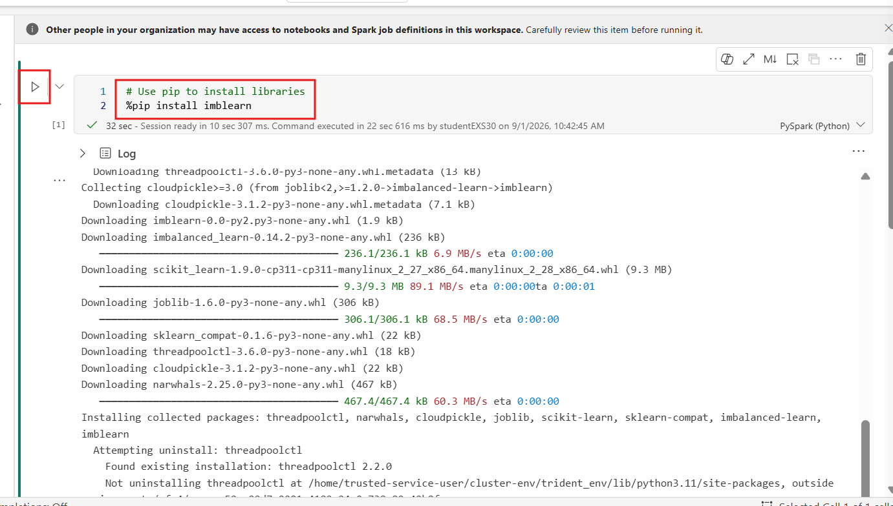

\[!Note\] The PySpark kernel restarts after %pip install runs. Install
the needed libraries before you run any other cells.

\[!Alert\] If you encounter an error in this step indicating an
incompatibility with the *filelock* version follow these steps to
correct it before continuing with this task:

- Select the **+ Code** icon below the latest cell output

- Enter the code:  
  %pip install imbalanced-learn filelock\<3.12

- Select the **▷ Run cell** icon to execute the code

3.  In your notebook, use the **+ Code** icon below the latest cell
    output to add a new code cell to the notebook.

4.  Select the code cell and click on the **play** button to execute
    cell.

```
IS_CUSTOM_DATA = False  # If TRUE, the dataset has to be uploaded manually

IS_SAMPLE = False  # If TRUE, use only SAMPLE_ROWS of data for training; otherwise, use all data
SAMPLE_ROWS = 5000  # If IS_SAMPLE is True, use only this number of rows for training

DATA_ROOT = "/lakehouse/default"
DATA_FOLDER = "Files/churn"  # Folder with data files
DATA_FILE = "churn.csv"  # Data file name
```

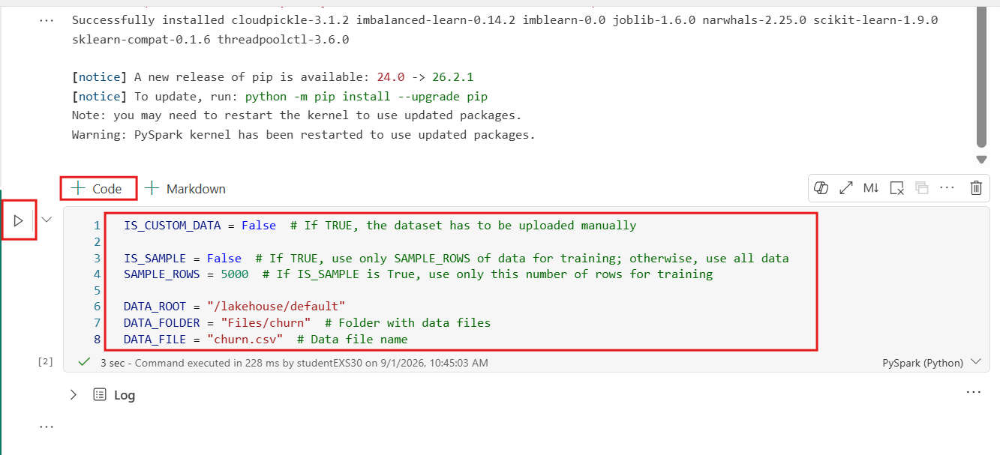

5.  In your notebook, use the **+ Code** icon below the latest cell
    output to add a new code cell to the notebook. Then enter the
    following code.This code downloads a publicly available version of
    the dataset and then stores it in a Fabric lakehouse. Select the
    code cell and click on the **play** button to execute cell.

```
import os, requests
if not IS_CUSTOM_DATA:
# With an Azure Synapse Analytics blob, this can be done in one line

# Download demo data files into the lakehouse if they don't exist
    remote_url = "https://synapseaisolutionsa.z13.web.core.windows.net/data/bankcustomerchurn"
    file_list = ["churn.csv"]
    download_path = "/lakehouse/default/Files/churn/raw"

    if not os.path.exists("/lakehouse/default"):
        raise FileNotFoundError(
            "Default lakehouse not found, please add a lakehouse and restart the session."
        )
    os.makedirs(download_path, exist_ok=True)
    for fname in file_list:
        if not os.path.exists(f"{download_path}/{fname}"):
            r = requests.get(f"{remote_url}/{fname}", timeout=30)
            with open(f"{download_path}/{fname}", "wb") as f:
                f.write(r.content)
    print("Downloaded demo data files into lakehouse.")
```

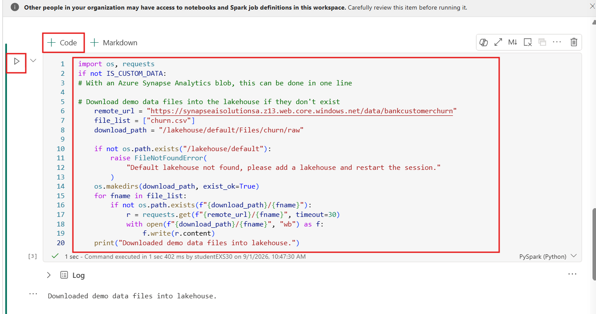

6.  Start recording the time needed to run the notebook. Use the **+
    Code** icon below the cell output to add a new code cell to the
    notebook, and enter the following code in it. Click on **▷ Run
    cell** button and review the output

```
# Record the notebook running time
import time

ts = time.time()
```

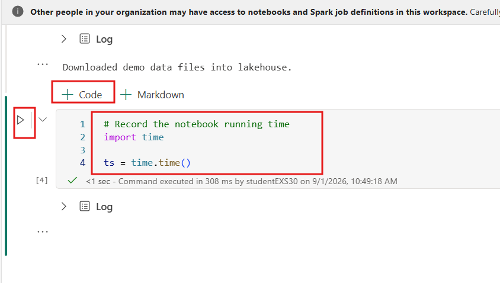

## Task 4: Explore and visualize data using Microsoft Fabric notebooks

The following code reads raw data from the **Files** section of the
lakehouse, and adds more columns for different date parts. Creation of
the partitioned delta table uses this information.

1.  Use the **+ Code** icon below the cell output to add a new code cell
    to the notebook, and enter the following code in it. Click on **▷
    Run cell** button and review the output

```
df = (
    spark.read.option("header", True)
    .option("inferSchema", True)
    .csv("Files/churn/raw/churn.csv")
    .cache()
)
```

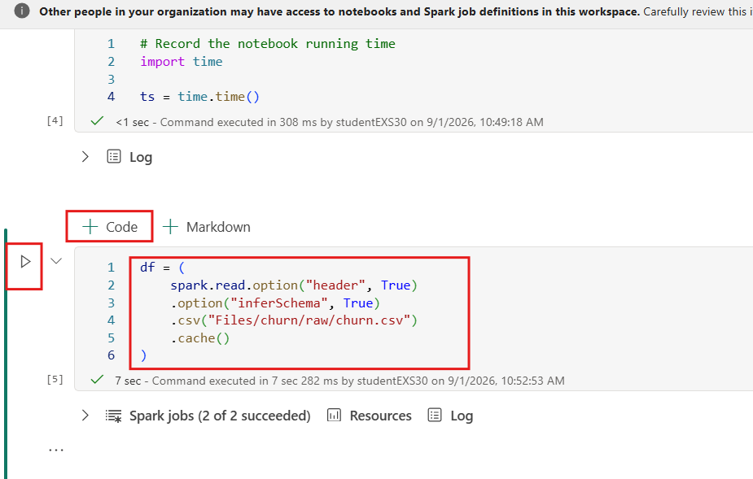

\[!Note\] You now need to convert the spark DataFrame to pandas
DataFrame for easier processing and visualization.

2.  Use the **+ Code** icon below the cell output to add a new code cell
    to the notebook, and enter the following code in it. Click on **▷
    Run cell** button and review the output

+++df = df.toPandas()+++

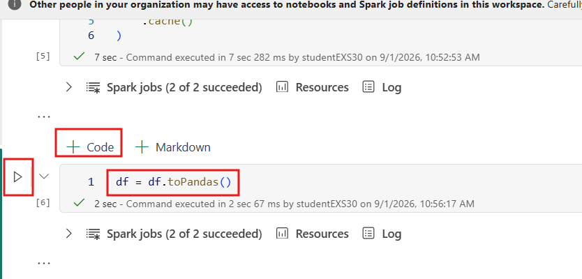

\[!Knowledge\] Explore the raw data with display, do some basic
statistics and show chart views. You first need to import required
libraries for data visualization such as seaborn, which is a Python data
visualization library to provide a high-level interface for building
visuals on DataFrames and arrays.

3.  Use the **+ Code** icon below the cell output to add a new code cell
    to the notebook, and enter the following code in it. Click on **▷
    Run cell** button and review the output

```
import seaborn as sns
sns.set_theme(style="whitegrid", palette="tab10", rc = {'figure.figsize':(9,6)})
import matplotlib.pyplot as plt
import matplotlib.ticker as mticker
from matplotlib import rc, rcParams
import numpy as np
import pandas as pd
import itertools
```

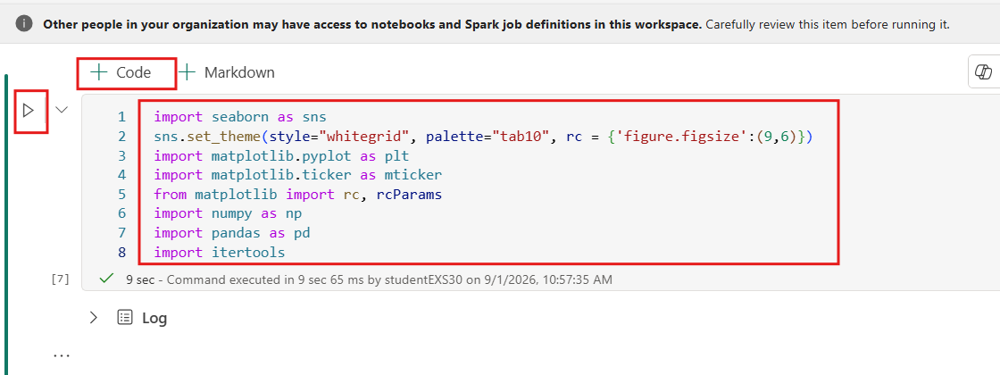

4.  Use the **+ Code** icon below the cell output to add a new code cell
    to the notebook, and enter the following code in it. Click on **▷
    Run cell** button and review the output

+++display(df, summary=True)+++

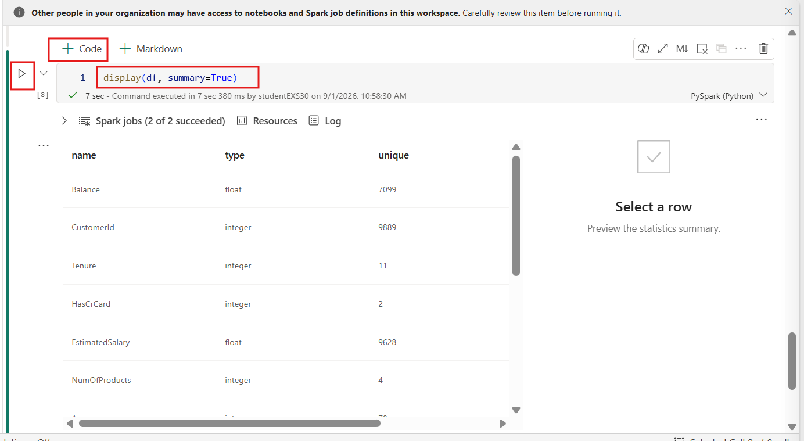

5.  Use Data Wrangler to perform initial data cleansing, under the
    notebook ribbon select **AI tools** tab, dropdown the **Data
    Wrangler** and select the **df** data wrangler.


\[!Note\] Once the Data Wrangler is launched, a descriptive overview of
the displayed data panel is generated.


6.  In df(Data Wrangler) pane, under **Operations** select the **Find
    and replace \> Drop duplicate rows.**


7.  Under the Target columns, select only
    the **RowNumber** and **CustomerId** check boxes, and then click on
    the **Apply** button.


8.  In df(Data Wrangler) pane, under **Operations** select the **Find
    and replace \> Drop missing values.**


9.  Under the Target columns, choose **Select all** from the **Target
    columns**, and then click on the **Apply** button.


10. Expand **Schema** and select **Drop columns**.

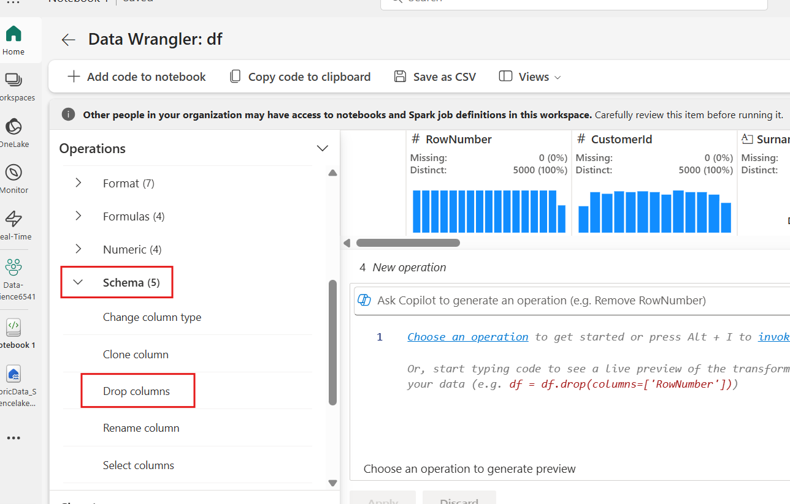

11. Select **RowNumber**, **CustomerId**, **Surname**. These columns
    appear in red in the preview, to show they're changed by the code
    (in this case, dropped.)

12. Select **Apply** to go on to the next step


13. Select **Add code to notebook** at the top left to close Data
    Wrangler and add the code automatically. The **Add code to
    notebook** wraps the code in a function, then calls the function.


14. Examine the code generated by Data Wrangler


15. Add the argument **inplace=True** to each of the generated steps. By
    setting inplace=True, pandas will overwrite the original DataFrame
    instead of producing a new DataFrame as an output. See
    the **Reference code** for comparison.


**Reference code:**

```
# Modified version of code generated by Data Wrangler 
# Modification is to add in-place=True to each step

# Define a new function that include all above Data Wrangler operations
def clean_data(df):
    # Drop rows with missing data across all columns
    df.dropna(inplace=True)
    # Drop duplicate rows in columns: 'RowNumber', 'CustomerId'
    df.drop_duplicates(subset=['RowNumber', 'CustomerId'], inplace=True)
    # Drop columns: 'RowNumber', 'CustomerId', 'Surname'
    df.drop(columns=['RowNumber', 'CustomerId', 'Surname'], inplace=True)
    return df

df_clean = clean_data(df.copy())
df_clean.head()
```
16. Click on **▷ Run cell** button and review the output

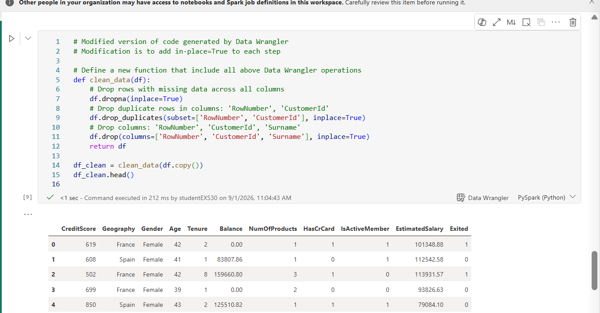

17. Use this code to determine categorical, numerical, and target
    attributes. Use the **+ Code** icon below the cell output to add a
    new code cell to the notebook, and enter the following code in it.
    Click on **▷ Run cell** button and review the output

```
# Determine the dependent (target) attribute
dependent_variable_name = "Exited"
print(dependent_variable_name)
# Determine the categorical attributes
categorical_variables = [col for col in df_clean.columns if col in "O"
                        or df_clean[col].nunique() <=5
                        and col not in "Exited"]
print(categorical_variables)
# Determine the numerical attributes
numeric_variables = [col for col in df_clean.columns if df_clean[col].dtype != "object"
                        and df_clean[col].nunique() >5]
print(numeric_variables)
```

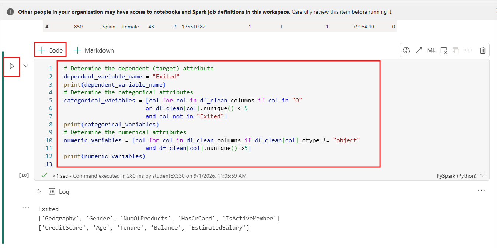

18. The code below generates box plots to display the five-number
    summary-minimum, first quartile, median, third quartile, and
    maximum-for the numerical attributes. Use the **+ Code** icon below
    the cell output to add a new code cell to the notebook, and enter
    the following code in it. Click on **▷ Run cell** button and review
    the output

```
df_num_cols = df_clean[numeric_variables]
sns.set(font_scale = 0.7) 
fig, axes = plt.subplots(nrows = 2, ncols = 3, gridspec_kw =  dict(hspace=0.3), figsize = (17,8))
fig.tight_layout()
for ax,col in zip(axes.flatten(), df_num_cols.columns):
    sns.boxplot(x = df_num_cols[col], color='green', ax = ax)
# fig.suptitle('visualize and compare the distribution and central tendency of numerical attributes', color = 'k', fontsize = 12)
fig.delaxes(axes[1,2])
```
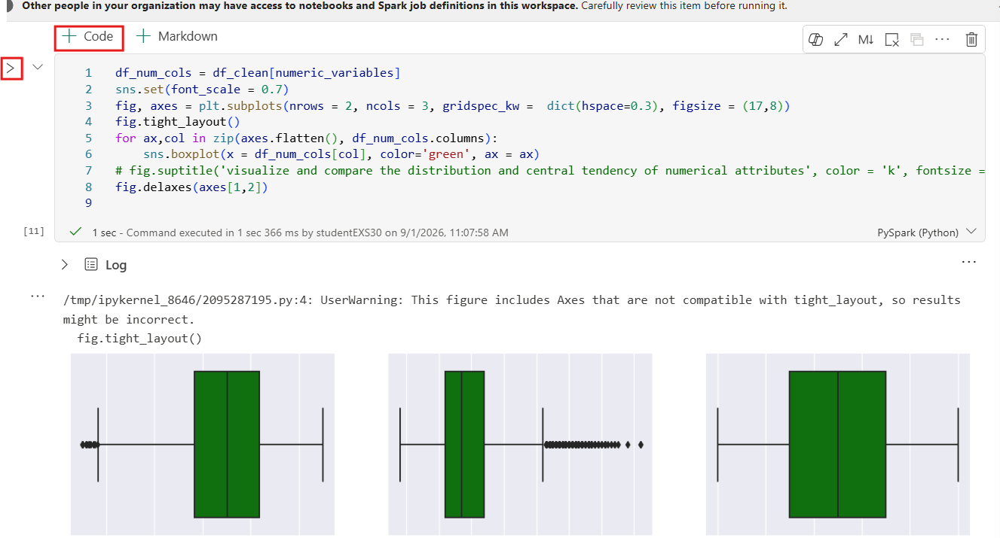


19. Use the **+ Code** icon below the cell output to add a new code cell
    to the notebook, and enter the following code in it. Click on **▷
    Run cell** button and review the output showing the distribution of
    exited versus nonexited customers across the categorical attributes.

```
attr_list = ['Geography', 'Gender', 'HasCrCard', 'IsActiveMember', 'NumOfProducts', 'Tenure']
df_clean['Exited'] = df_clean['Exited'].astype(str)
fig, axarr = plt.subplots(2, 3, figsize=(15, 4))
for ind, item in enumerate (attr_list):
    sns.countplot(x = item, hue = 'Exited', data = df_clean, ax = axarr[ind%2][ind//2])
fig.subplots_adjust(hspace=0.7)
```

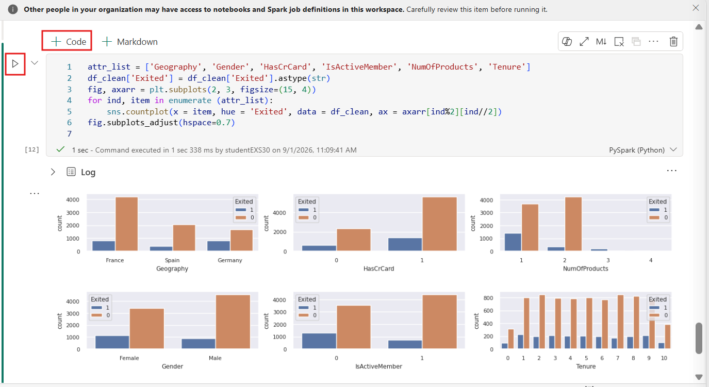

20. Use the **+ Code** icon below the cell output to add a new code cell
    to the notebook, and enter the following code in it. Click on **▷
    Run cell** button and review the output showing the frequency
    distribution of numerical attributes using histogram.

```
columns = df_num_cols.columns[: len(df_num_cols.columns)]
fig = plt.figure()
fig.set_size_inches(18, 8)
length = len(columns)
for i,j in itertools.zip_longest(columns, range(length)):
    plt.subplot((length // 2), 3, j+1)
    plt.subplots_adjust(wspace = 0.2, hspace = 0.5)
    df_num_cols[i].hist(bins = 20, edgecolor = 'black')
    plt.title(i)
plt.show()
```


21. Perform feature engineering to create new attributes derived from
    the existing ones. Use the **+ Code** icon below the cell output to
    add a new code cell to the notebook, and enter the following code in
    it. Click on **▷ Run cell** button and review the output.

```
df_clean["NewTenure"] = df_clean["Tenure"]/df_clean["Age"]
df_clean["NewCreditsScore"] = pd.qcut(df_clean['CreditScore'], 6, labels = [1, 2, 3, 4, 5, 6])
df_clean["NewAgeScore"] = pd.qcut(df_clean['Age'], 8, labels = [1, 2, 3, 4, 5, 6, 7, 8])
df_clean["NewBalanceScore"] = pd.qcut(df_clean['Balance'].rank(method="first"), 5, labels = [1, 2, 3, 4, 5])
df_clean["NewEstSalaryScore"] = pd.qcut(df_clean['EstimatedSalary'], 10, labels = [1, 2, 3, 4, 5, 6, 7, 8, 9, 10])
```

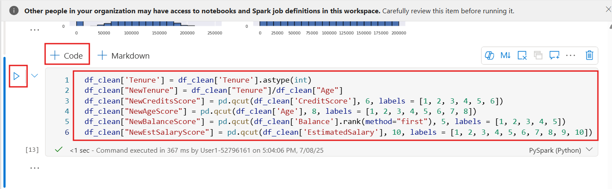

## Task 5: Use Data Wrangler to perform one-hot encoding

Data Wrangler can also be used to perform one-hot encoding. To do so,
re-open Data Wrangler. This time, select the df_clean data.

1.  Use Data Wrangler to perform initial data cleansing, under the
    notebook ribbon select **AI tools** tab, dropdown the **Data
    Wrangler** and select the **df_clean** data wrangler.


2.  Expand **Formulas** and select **One-hot encode**.


3.  A panel appears for you to select the list of columns you want to
    perform one-hot encoding on. Select **Geography** and **Gender** and
    then Click **Apply**.


4.  Select **Add code to notebook** at the top left to close Data
    Wrangler and add the code automatically


5.  Click on **▷ Run cell** button and review the output


## Task 6: Create a delta table for the cleaned data

1.  Use the **+ Code** icon below the cell output to add a new code cell
    to the notebook, and enter the following code in it. Click on **▷
    Run cell** button and review the output

```
table_name = "df_clean"
# Create a PySpark DataFrame from pandas
sparkDF=spark.createDataFrame(df_clean) 
sparkDF.write.mode("overwrite").format("delta").save(f"Tables/{table_name}")
print(f"Spark DataFrame saved to delta table: {table_name}")
```
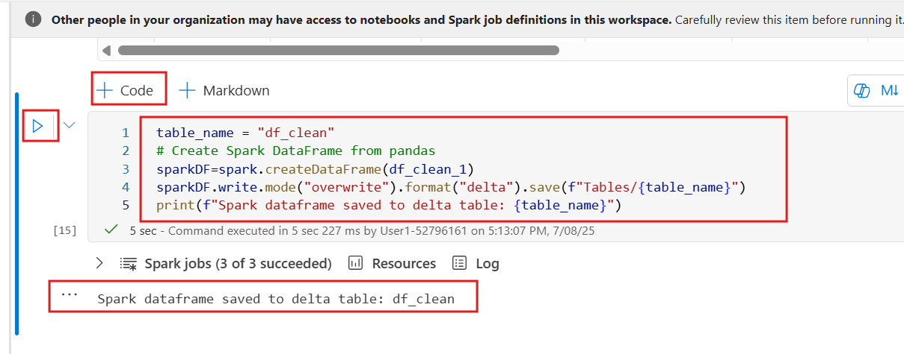

## Task 7: Train and register a machine learning model

Install the imbalanced-learn library (imported as imblearn) using %pip
install; this library provides techniques like SMOTE for addressing
imbalanced datasets. Since the PySpark kernel will restart after
installation, ensure this cell is run before executing any others.

\[!Alert\] Before training any machine learning model, ensure you load
the Delta table from the Lakehouse to access the cleaned dataset
prepared in the previous task.

1.  Use the **+ Code** icon below the cell output to add a new code cell
    to the notebook, and enter the following code in it. Click on **▷
    Run cell** button and review the output.

```
SEED = 12345
df_clean = spark.read.format("delta").load("Tables/df_clean").toPandas()
```


2.  To generate an experiment for tracking and logging the model using
    MLflow use the **+ Code** icon below the cell output to add a new
    code cell to the notebook, and enter the following code in it. Click
    on **▷ Run cell** button and review the output.

```
import mlflow
# Set up the experiment name
EXPERIMENT_NAME = "sample-bank-churn-experiment"  # MLflow experiment name
```
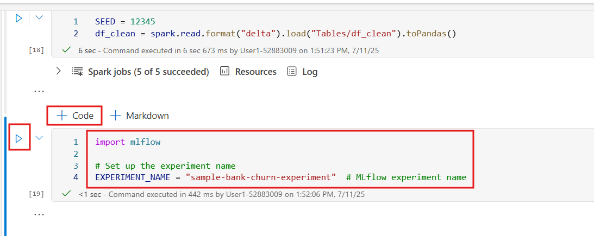

3.  Set experiment and autologging specifications. Use the **+
    Code** icon below the cell output to add a new code cell to the
    notebook, and enter the following code in it. Click on **▷ Run
    cell** button and review the output.

```
mlflow.set_experiment(EXPERIMENT_NAME) # Use a date stamp to append to the experiment
mlflow.autolog(exclusive=False)
```

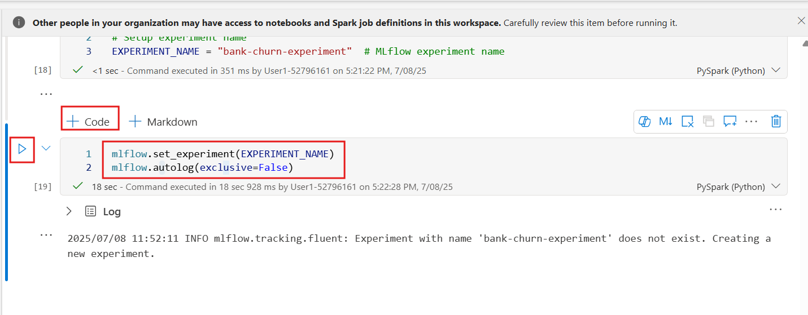

\[!Note\] With the data now loaded, the next step is to define and train
machine learning models. This notebook demonstrates how to implement
Random Forest and **LightGBM** using
the **scikit-learn** and **lightgbm** libraries in just a few lines of
code.

4.  Use the **+ Code** icon below the cell output to add a new code cell
    to the notebook, and enter the following code in it. Click on **▷
    Run cell** button and review the output

```
# Import the required libraries for model training
from sklearn.model_selection import train_test_split
from lightgbm import LGBMClassifier
from sklearn.ensemble import RandomForestClassifier
from sklearn.metrics import accuracy_score, f1_score, precision_score, confusion_matrix, recall_score, roc_auc_score, classification_report
```


5.  Use the train_test_split function from **scikit-learn** to split the
    data into training, validation, and test sets. Select the **+
    Code** icon below the cell output to add a new code cell to the
    notebook, and enter the following code in it. Click on **▷ Run
    cell** button and review the output.

```
y = df_clean["Exited"]
X = df_clean.drop("Exited",axis=1)
# Train/test separation
X_train, X_test, y_train, y_test = train_test_split(X, y, test_size=0.20, random_state=SEED)
```

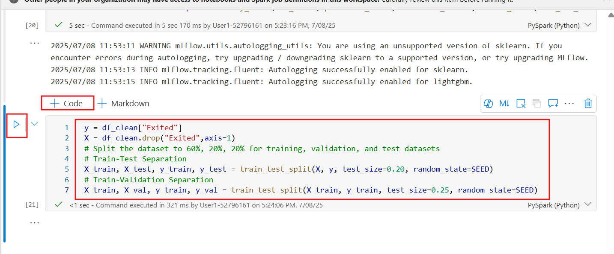

6.  Apply SMOTE to the training data to synthesize new samples for the
    minority class. Use the **+ Code** icon below the cell output to add
    a new code cell to the notebook, and enter the following code in it.
    Click on **▷ Run cell** button and review the output

```
from collections import Counter
from imblearn.over_sampling import SMOTE

# SMOTE and most scikit-learn / imblearn utilities require purely numeric feature matrices.
# Your X_train currently includes categorical columns such as 'Geography', 'Gender', etc.
# We need to one-hot encode the non-numeric columns before calling SMOTE.

# Identify numeric and non-numeric columns
X_train_num = X_train.select_dtypes(include=["number"])
X_train_cat = X_train.select_dtypes(exclude=["number"])

# One-hot encode categorical columns (drop_first to avoid multicollinearity)
if not X_train_cat.empty:
    X_train_cat_encoded = pd.get_dummies(X_train_cat, drop_first=True)
    X_train_encoded = pd.concat([X_train_num.reset_index(drop=True),
                                 X_train_cat_encoded.reset_index(drop=True)], axis=1)
else:
    X_train_encoded = X_train_num.copy()

# Apply SMOTE on the fully numeric matrix
sm = SMOTE(random_state=SEED)
X_res, y_res = sm.fit_resample(X_train_encoded, y_train)

# Build the resampled training DataFrame
new_train = pd.concat([X_res, y_res.reset_index(drop=True)], axis=1)
new_train.head()
```
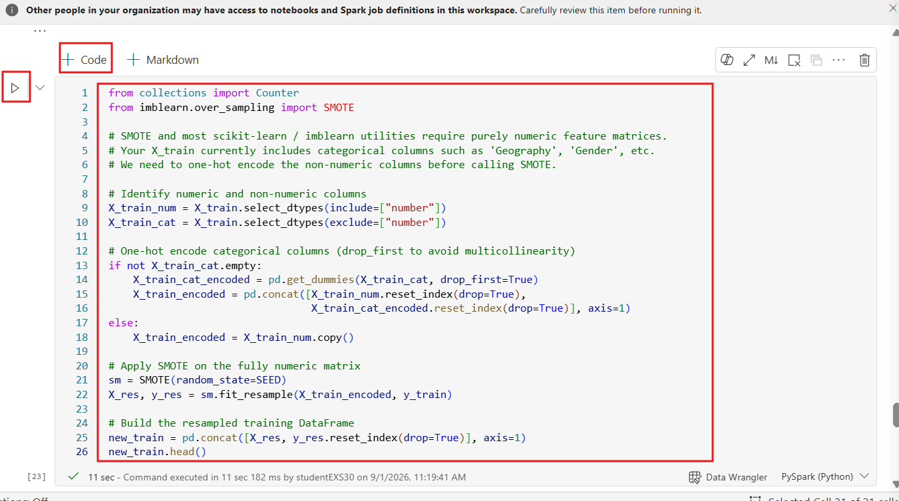

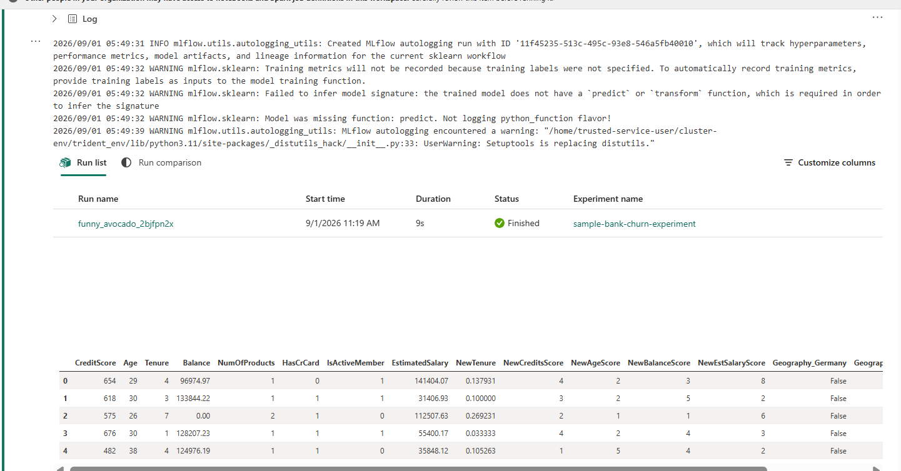

7.  Train the model using Random Forest with maximum depth of 4 and 4
    features. Use the **+ Code** icon below the cell output to add a new
    code cell to the notebook, and enter the following code in it. Click
    on **▷ Run cell** button and review the output.

```
mlflow.sklearn.autolog(registered_model_name='rfc1_sm')  # Register the trained model with autologging
rfc1_sm = RandomForestClassifier(max_depth=4, max_features=4, min_samples_split=3, random_state=1) # Pass hyperparameters

# Ensure test features have the same encoding as the training data used with SMOTE
# 1) Build the same preprocessing for X_test as was done for X_train before SMOTE
X_test_num = X_test.select_dtypes(include=["number"])
X_test_cat = X_test.select_dtypes(exclude=["number"])

if not X_test_cat.empty:
    X_test_cat_encoded = pd.get_dummies(X_test_cat, drop_first=True)
    X_test_encoded = pd.concat([
        X_test_num.reset_index(drop=True),
        X_test_cat_encoded.reset_index(drop=True)
    ], axis=1)
else:
    X_test_encoded = X_test_num.copy()

# 2) Align test feature columns with the training feature columns used for fitting the model
#    (X_res is the resampled, fully numeric training matrix after SMOTE)
missing_cols = set(X_res.columns) - set(X_test_encoded.columns)
for c in missing_cols:
    X_test_encoded[c] = 0  # add any missing dummy columns as zeros

# Keep only the columns that the model saw during fit, in the same order
X_test_encoded = X_test_encoded[X_res.columns]

with mlflow.start_run(run_name="rfc1_sm") as run:
    rfc1_sm_run_id = run.info.run_id # Capture run_id for model prediction later
    print("run_id: {}; status: {}".format(rfc1_sm_run_id, run.info.status))

    # Fit on the resampled, encoded training data
    rfc1_sm.fit(X_res, y_res.ravel())  # Balanced training data

    # Evaluate on the encoded test data
    rfc1_sm.score(X_test_encoded, y_test)
    y_pred = rfc1_sm.predict(X_test_encoded)

    cr_rfc1_sm = classification_report(y_test, y_pred)
    cm_rfc1_sm = confusion_matrix(y_test, y_pred)
    roc_auc_rfc1_sm = roc_auc_score(y_res, rfc1_sm.predict_proba(X_res)[:, 1])
```
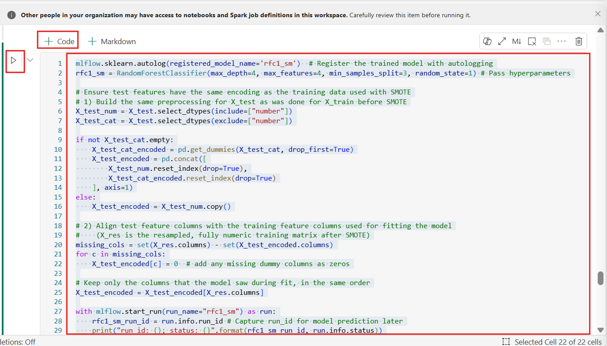

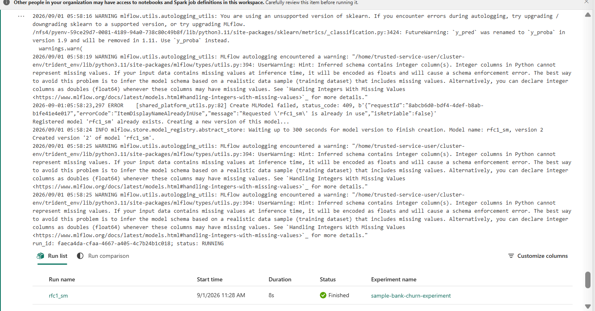

8.  Train the model using Random Forest with maximum depth of 8 and 6
    features. Use the **+ Code** icon below the cell output to add a new
    code cell to the notebook, and enter the following code in it. Click
    on **▷ Run cell** button and review the output

```
mlflow.sklearn.autolog(registered_model_name='rfc2_sm')  # Register the trained model with autologging
rfc2_sm = RandomForestClassifier(max_depth=8, max_features=6, min_samples_split=3, random_state=1) # Pass hyperparameters

# Ensure test features have the same encoding as the training data used with SMOTE
# 1) Build the same preprocessing for X_test as was done for X_train before SMOTE
X_test_num = X_test.select_dtypes(include=["number"])
X_test_cat = X_test.select_dtypes(exclude=["number"])

if not X_test_cat.empty:
    X_test_cat_encoded = pd.get_dummies(X_test_cat, drop_first=True)
    X_test_encoded = pd.concat([
        X_test_num.reset_index(drop=True),
        X_test_cat_encoded.reset_index(drop=True)
    ], axis=1)
else:
    X_test_encoded = X_test_num.copy()

# 2) Align test feature columns with the training feature columns used for fitting the model
#    (X_res is the resampled, fully numeric training matrix after SMOTE)
missing_cols = set(X_res.columns) - set(X_test_encoded.columns)
for c in missing_cols:
    X_test_encoded[c] = 0  # add any missing dummy columns as zeros

# Keep only the columns that the model saw during fit, in the same order
X_test_encoded = X_test_encoded[X_res.columns]

with mlflow.start_run(run_name="rfc2_sm") as run:
    rfc2_sm_run_id = run.info.run_id # Capture run_id for model prediction later
    print("run_id: {}; status: {}".format(rfc2_sm_run_id, run.info.status))
    # rfc2.fit(X_train,y_train) # Imbalanced training data
    rfc2_sm.fit(X_res, y_res.ravel()) # Balanced training data

    # Evaluate on the encoded test data
    rfc2_sm.score(X_test_encoded, y_test)
    y_pred = rfc2_sm.predict(X_test_encoded)

    cr_rfc2_sm = classification_report(y_test, y_pred)
    cm_rfc2_sm = confusion_matrix(y_test, y_pred)
    roc_auc_rfc2_sm = roc_auc_score(y_res, rfc2_sm.predict_proba(X_res)[:, 1])
```

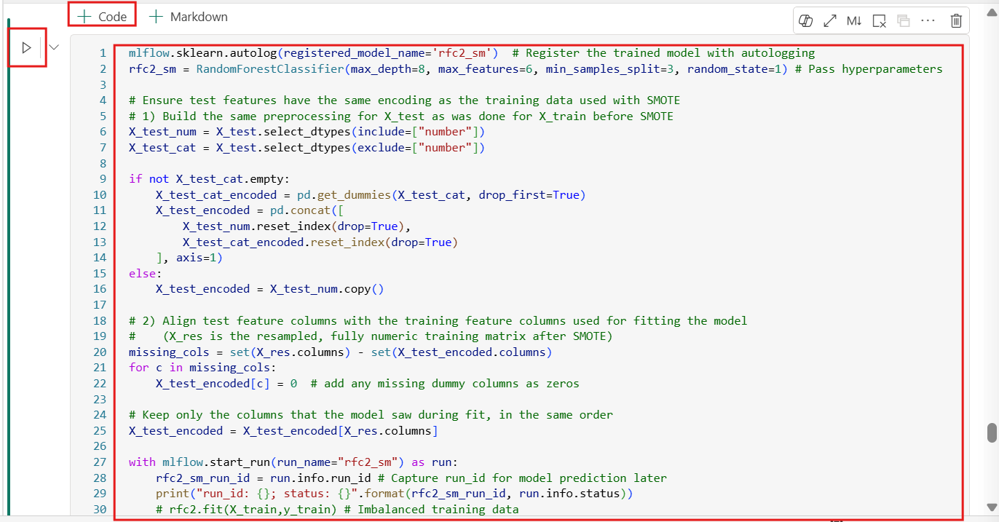

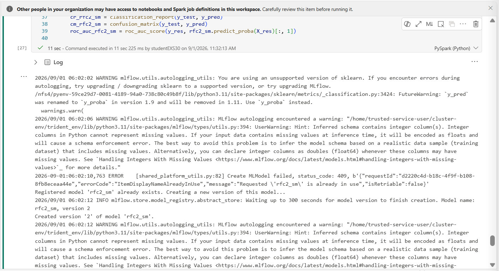

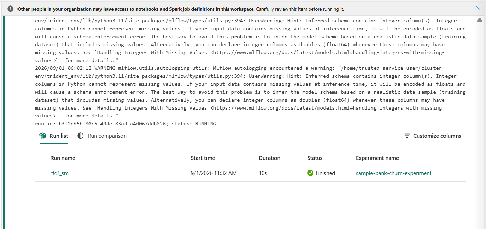

9.  Train the model using LightGBM. Use the **+ Code** icon below the
    cell output to add a new code cell to the notebook, and enter the
    following code in it. Click on **▷ Run cell** button and review the
    output

```
# lgbm_model
mlflow.lightgbm.autolog(registered_model_name='lgbm_sm')  # Register the trained model with autologging
lgbm_sm_model = LGBMClassifier(
    learning_rate=0.07,
    max_delta_step=2,
    n_estimators=100,
    max_depth=10,
    eval_metric="logloss",
    objective='binary',
    random_state=42
)

# --- IMPORTANT ---
# The model was trained on the SMOTE-resampled, one-hot-encoded feature matrix X_res.
# To avoid the "Number of features of the model must match the input" error,
# we must apply the *same* encoding logic to X_test and align its columns
# to match X_res before calling predict / predict_proba.

# 1) Build encoded test features, mirroring the preprocessing of X_train
X_test_num = X_test.select_dtypes(include=["number"])
X_test_cat = X_test.select_dtypes(exclude=["number"])

if not X_test_cat.empty:
    X_test_cat_encoded = pd.get_dummies(X_test_cat, drop_first=True)
    X_test_encoded = pd.concat([
        X_test_num.reset_index(drop=True),
        X_test_cat_encoded.reset_index(drop=True)
    ], axis=1)
else:
    X_test_encoded = X_test_num.copy()

# 2) Align columns with X_res (training features) used to fit the model
missing_cols = set(X_res.columns) - set(X_test_encoded.columns)
for c in missing_cols:
    X_test_encoded[c] = 0  # add any missing dummy columns with zeros

# Keep only the columns that the model saw during fit, in the same order
X_test_encoded = X_test_encoded[X_res.columns]

with mlflow.start_run(run_name="lgbm_sm") as run:
    lgbm1_sm_run_id = run.info.run_id  # Capture run_id for model prediction later

    # Fit on the resampled, encoded training data
    lgbm_sm_model.fit(X_res, y_res.ravel())  # Balanced training data

    # Predict on the encoded test data to match training feature space
    y_pred = lgbm_sm_model.predict(X_test_encoded)

    accuracy = accuracy_score(y_test, y_pred)
    cr_lgbm_sm = classification_report(y_test, y_pred)
    cm_lgbm_sm = confusion_matrix(y_test, y_pred)
    roc_auc_lgbm_sm = roc_auc_score(y_res, lgbm_sm_model.predict_proba(X_res)[:, 1])
```

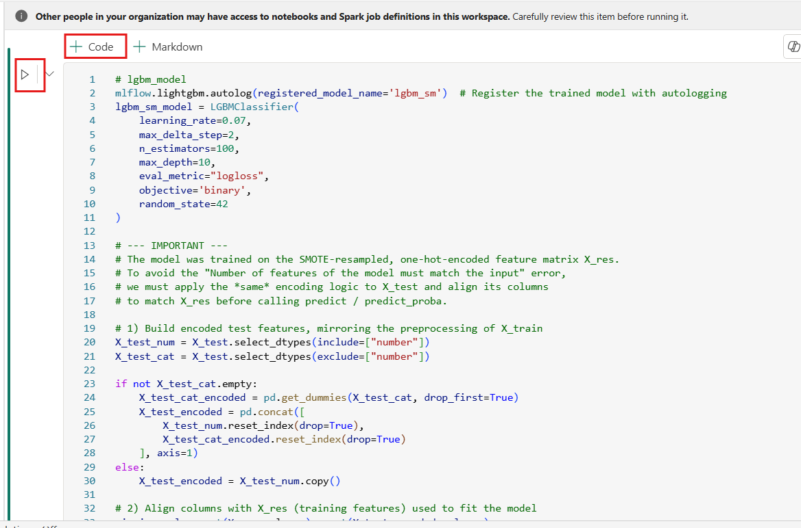

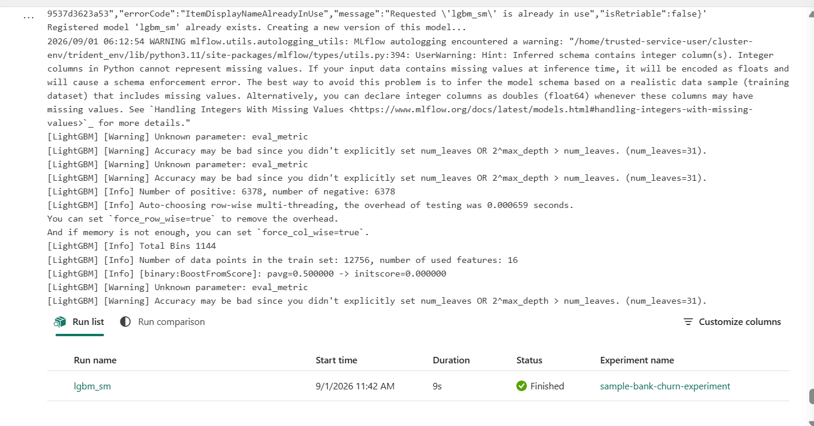

## Task 8: Experiments artifact for tracking model performance

1.  Select **Data-Science@lab.LabInstance.IdX** in the left navigation
    pane.

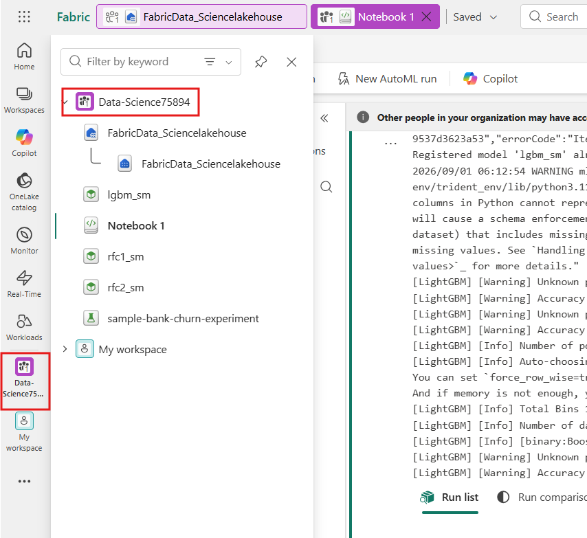

2.  On the top right, drop down the filter and select Experiments.

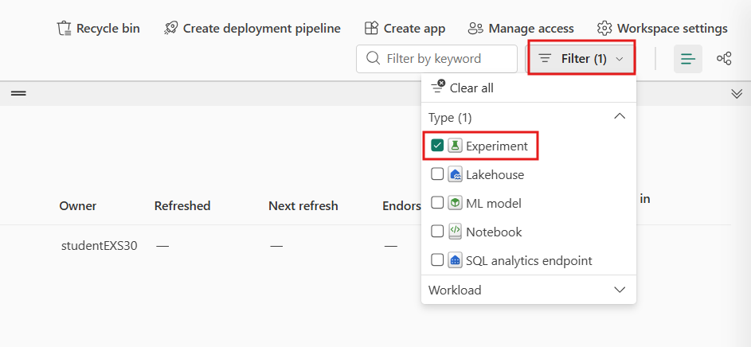

3.  Select **sample** **bank-churn-experiment**

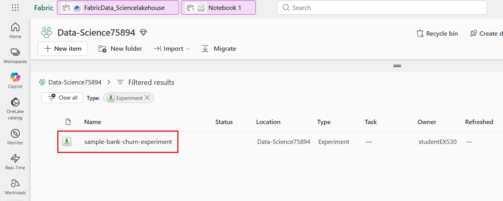


## Task 9: Assess the performances of the trained models on the validation dataset

1.  Select **Notebook1** in the top navigation pane.

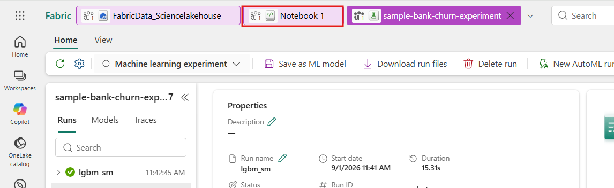

2.  Open the saved experiment from the workspace, load the machine
    learning models, and evaluate their performance on the validation
    dataset.

3.  Use the **+ Code** icon below the cell output to add a new code cell
    to the notebook, and enter the following code in it. Click on **▷
    Run cell** button and review the output

```
# Define run_uri to fetch the model
# MLflow client: mlflow.model.url, list model
load_model_rfc1_sm = mlflow.sklearn.load_model(f"runs:/{rfc1_sm_run_id}/model")
load_model_rfc2_sm = mlflow.sklearn.load_model(f"runs:/{rfc2_sm_run_id}/model")
load_model_lgbm1_sm = mlflow.lightgbm.load_model(f"runs:/{lgbm1_sm_run_id}/model")
```

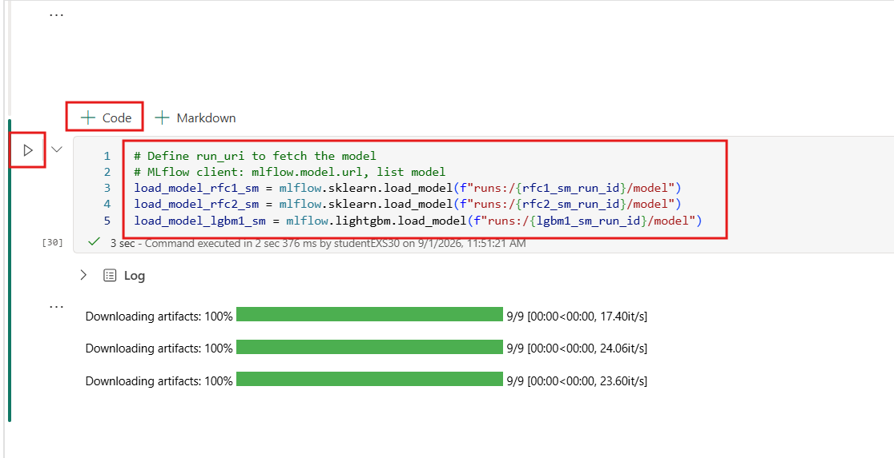

4.  Directly assess the performance of the trained machine learning
    models on the validation dataset.

5.  Use the **+ Code** icon below the cell output to add a new code cell
    to the notebook, and enter the following code in it. Click on **▷
    Run cell** button and review the output

```
# Use the same encoding pipeline for X_test that was used to train the models (X_res)

# 1) Split numeric and categorical columns in the original X_test
X_test_num = X_test.select_dtypes(include=["number"])
X_test_cat = X_test.select_dtypes(exclude=["number"])

# 2) One-hot encode the categorical columns (same as training: drop_first=True)
if not X_test_cat.empty:
    X_test_cat_encoded = pd.get_dummies(X_test_cat, drop_first=True)
    X_test_encoded = pd.concat([
        X_test_num.reset_index(drop=True),
        X_test_cat_encoded.reset_index(drop=True)
    ], axis=1)
else:
    X_test_encoded = X_test_num.copy()

# 3) Align encoded test features to the training feature space used for fitting (X_res.columns)
#    - Add any missing columns with zeros
missing_cols = set(X_res.columns) - set(X_test_encoded.columns)
for c in missing_cols:
    X_test_encoded[c] = 0

#    - Drop any extra columns not seen during training
extra_cols = set(X_test_encoded.columns) - set(X_res.columns)
if extra_cols:
    X_test_encoded = X_test_encoded.drop(columns=list(extra_cols))

#    - Reorder columns to exactly match the training feature order
X_test_encoded = X_test_encoded[X_res.columns]

# 4) Use the loaded models to predict on the encoded feature matrix
ypred_rfc1_sm = load_model_rfc1_sm.predict(X_test_encoded)  # Random forest with max depth 4 and 4 features
ypred_rfc2_sm = load_model_rfc2_sm.predict(X_test_encoded)  # Random forest with max depth 8 and 6 features
ypred_lgbm1_sm = load_model_lgbm1_sm.predict(X_test_encoded)  # LightGBM
```

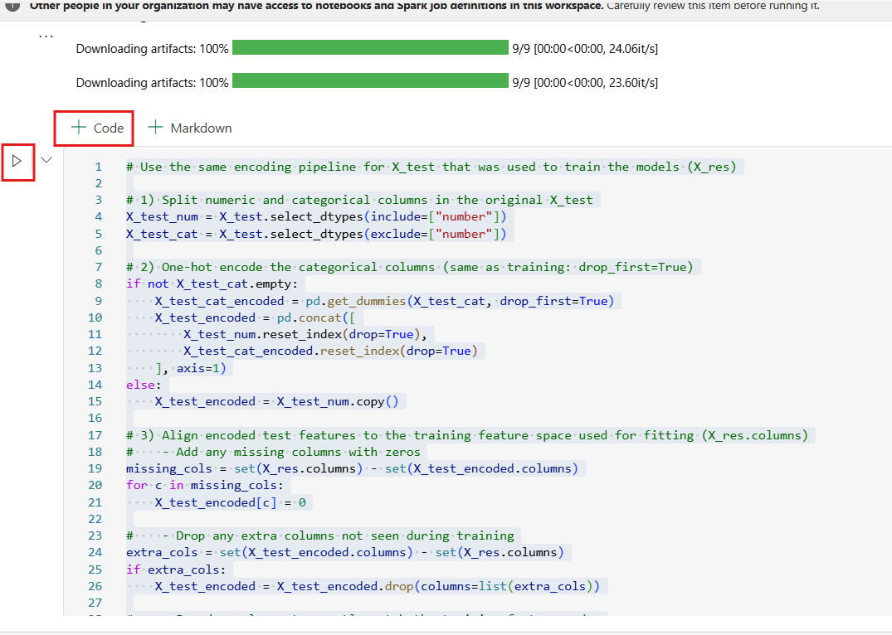

6.  To evaluate the accuracy of the classification model, generate and
    analyze the confusion matrix using predictions from the validation
    dataset.

7.  Use the **+ Code** icon below the cell output to add a new code cell
    to the notebook, and enter the following code in it. Click on **▷
    Run cell** button and review the output

```
def plot_confusion_matrix(cm, classes,
                          normalize=False,
                          title='Confusion matrix',
                          cmap=plt.cm.Blues):
    print(cm)
    plt.figure(figsize=(4,4))
    plt.rcParams.update({'font.size': 10})
    plt.imshow(cm, interpolation='nearest', cmap=cmap)
    plt.title(title)
    plt.colorbar()
    tick_marks = np.arange(len(classes))
    plt.xticks(tick_marks, classes, rotation=45, color="blue")
    plt.yticks(tick_marks, classes, color="blue")

    fmt = '.2f' if normalize else 'd'
    thresh = cm.max() / 2.
    for i, j in itertools.product(range(cm.shape[0]), range(cm.shape[1])):
        plt.text(j, i, format(cm[i, j], fmt),
                 horizontalalignment="center",
                 color="red" if cm[i, j] > thresh else "black")

    plt.tight_layout()
    plt.ylabel('True label')
    plt.xlabel('Predicted label')
```

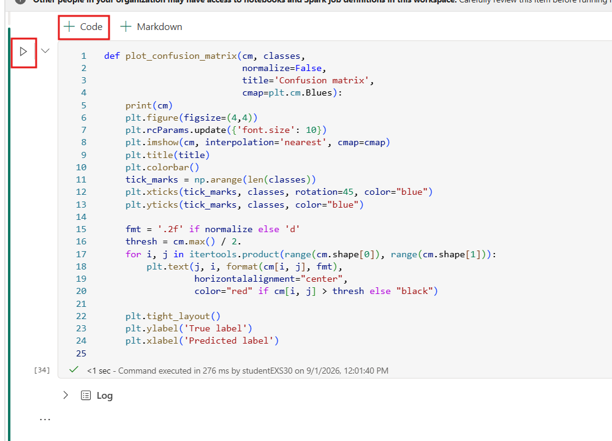

8.  Confusion Matrix for Random Forest Classifier with maximum depth of
    4 and 4 features

9.  Use the **+ Code** icon below the cell output to add a new code cell
    to the notebook, and enter the following code in it. Click on **▷
    Run cell** button and review the output

```
cfm = confusion_matrix(y_test, y_pred=ypred_rfc1_sm)
plot_confusion_matrix(cfm, classes=['Non Churn','Churn'],
                      title='Random Forest with max depth of 4')
tn, fp, fn, tp = cfm.ravel()
```

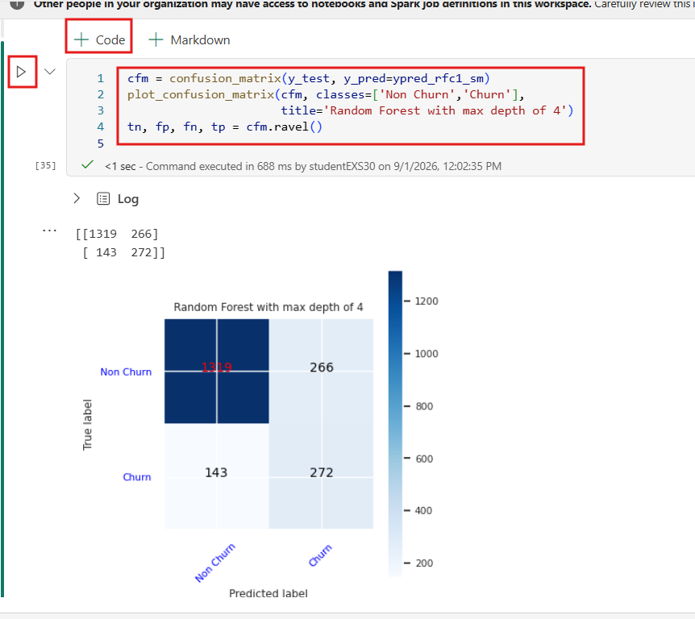

10. Confusion Matrix for Random Forest Classifier with maximum depth of
    8 and 6 features

11. Use the **+ Code** icon below the cell output to add a new code cell
    to the notebook, and enter the following code in it. Click on **▷
    Run cell** button and review the output

```
cfm = confusion_matrix(y_test, y_pred=ypred_rfc2_sm)
plot_confusion_matrix(cfm, classes=['Non Churn','Churn'],
                      title='Random Forest with max depth of 8')
tn, fp, fn, tp = cfm.ravel()
```


12. Confusion Matrix for LightGBM. Use the **+ Code** icon below the
    cell output to add a new code cell to the notebook, and enter the
    following code in it. Click on **▷ Run cell** button and review the
    output.

```
cfm = confusion_matrix(y_test, y_pred=ypred_lgbm1_sm)
plot_confusion_matrix(cfm, classes=['Non Churn','Churn'],
                      title='LightGBM')
tn, fp, fn, tp = cfm.ravel()
```


## Task 10: Save results for Power BI

1.  Save the delta frame to the lakehouse, to move the model prediction
    results to a Power BI visualization.

2.  Load the test data. Use the **+ Code** icon below the cell output to
    add a new code cell to the notebook, and enter the following code in
    it. Click on **▷ Run cell** button and review the output

```
df_pred = X_test.copy()
df_pred['y_test'] = y_test
df_pred['ypred_rfc1_sm'] = ypred_rfc1_sm
df_pred['ypred_rfc2_sm'] =ypred_rfc2_sm
df_pred['ypred_lgbm1_sm'] = ypred_lgbm1_sm
table_name = "df_pred_results"
sparkDF=spark.createDataFrame(df_pred)
sparkDF.write.mode("overwrite").format("delta").option("overwriteSchema", "true").save(f"Tables/{table_name}")
print(f"Spark DataFrame saved to delta table: {table_name}")
```
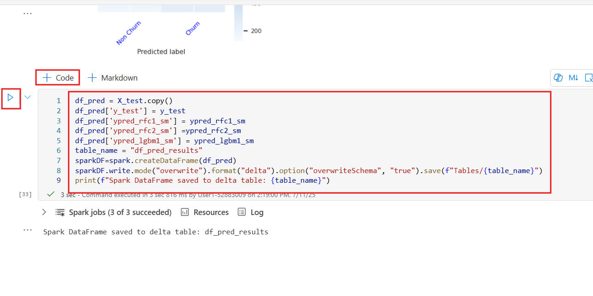

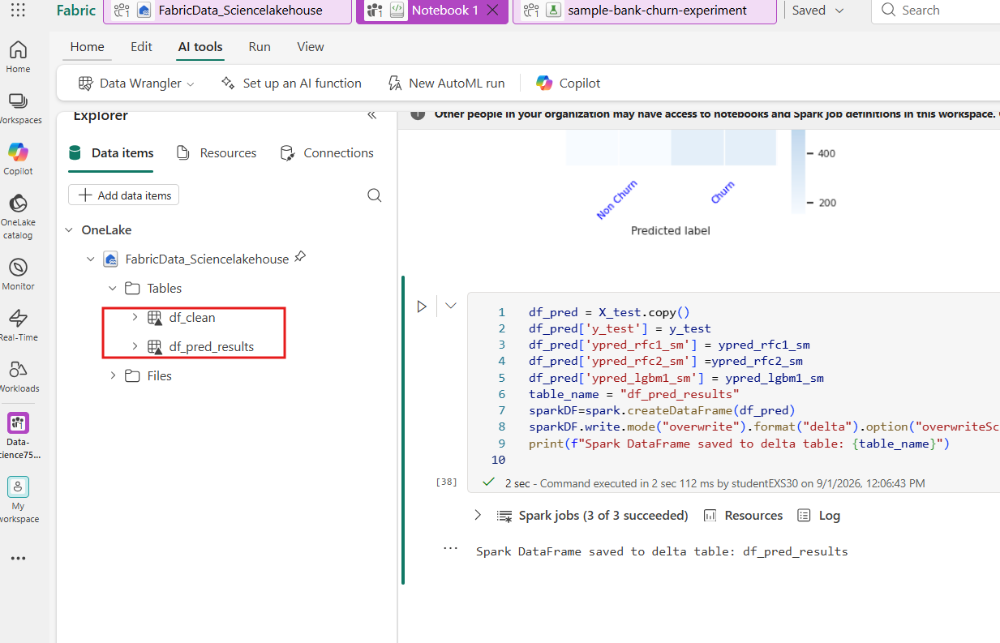

## Task 11: Create a semantic model

1.  Now, click on **FabricData_Sciencelakehouse** on the top navigation
    pane

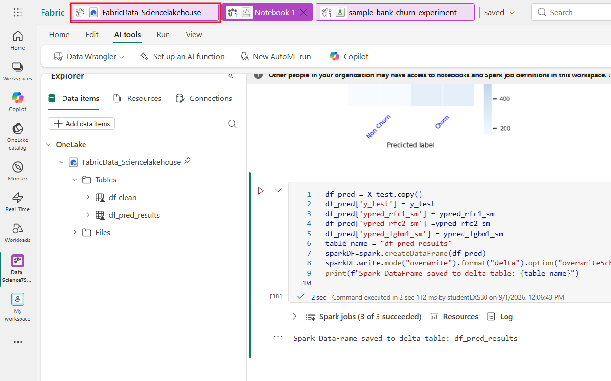

2.  Select **New semantic model** on the top ribbon.

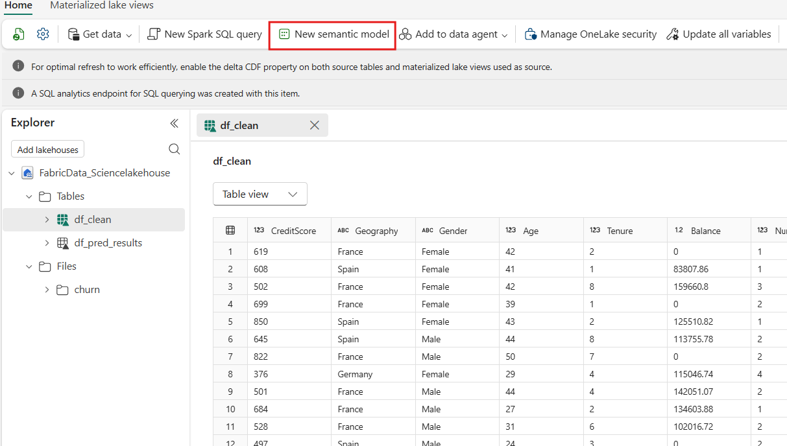

3.  In the **New dataset** box, enter the dataset a name, such as
    +++**bank churn predictions**+++ . Then select
    the **df_pred_results** dataset and select **Confirm**.

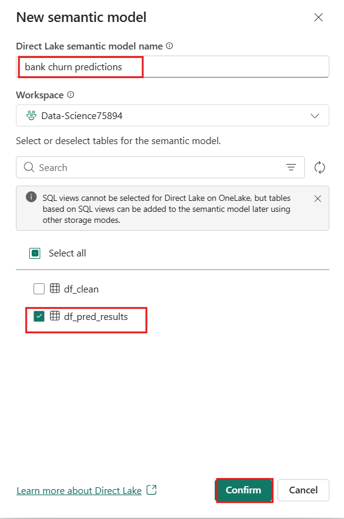

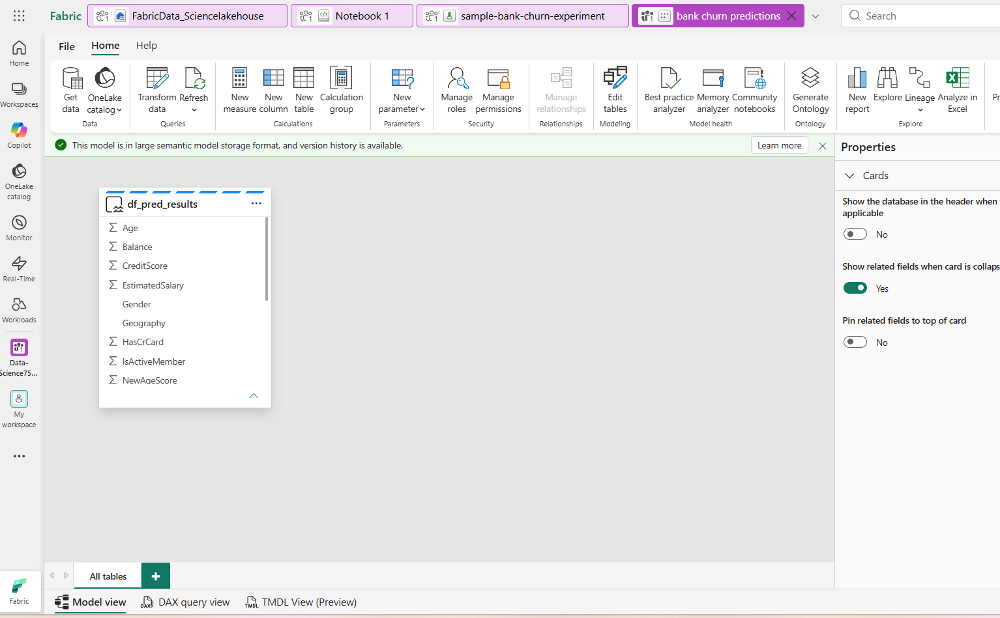

4.  Select [**Data-Science@lab.LabInstance.IdX**](mailto:Data-Science@lab.LabInstance.IdX) in
    the left navigation pane.

5.  Select and right-click the ***Bank Churn Predictions*** semantic
    model, then select ***Auto-create a report***, as shown in the
    following image.

> 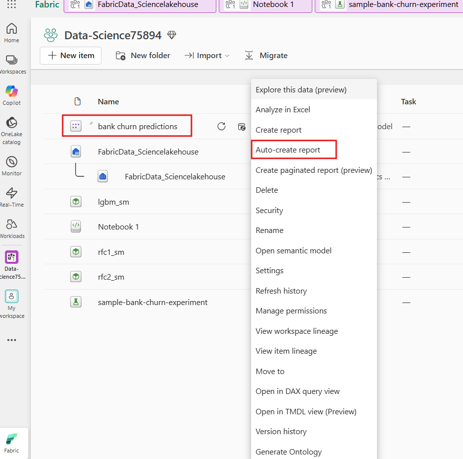

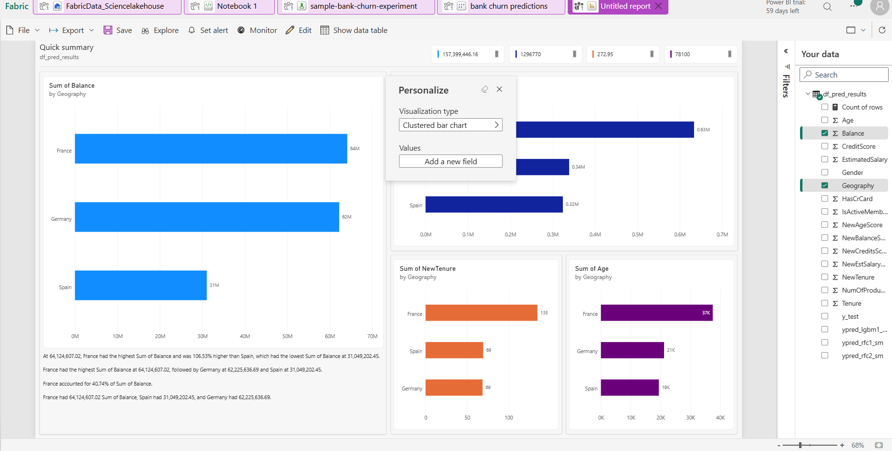

6.  Save this report for the future by selecting **Save** from the top
    ribbon.


7.  In the **Save your replort** dialog box, enter a name for your
    report as +++**Bank churn**+++ and select **Save.**

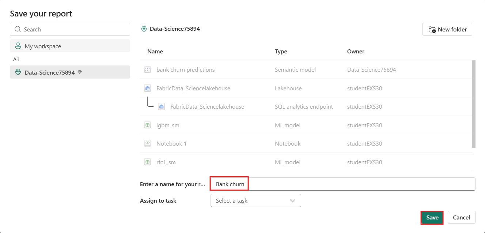

8.  Select **bank churn predictions** semantic model in the left
    navigation pane

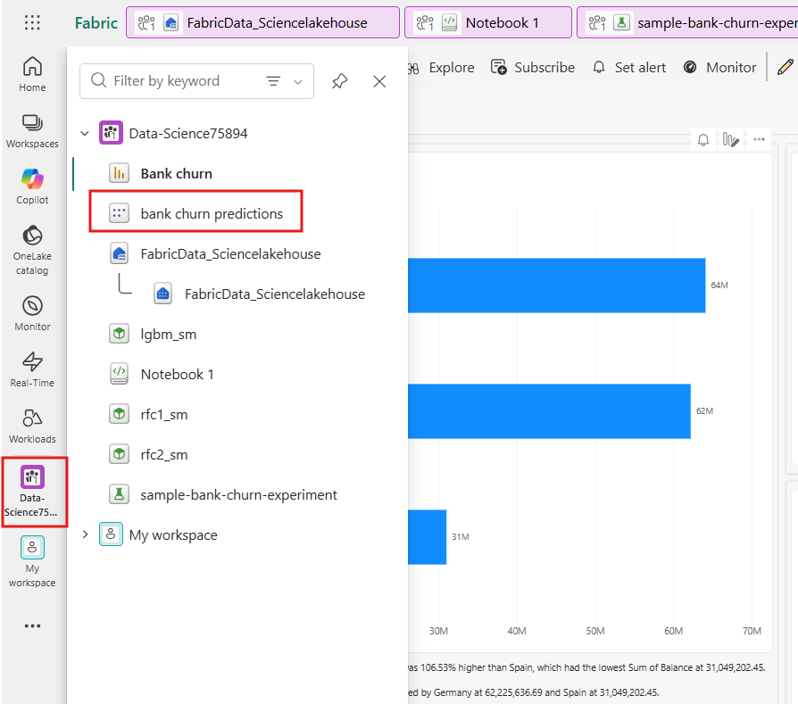

9.  In Home page, dropdown the Editing and select **Editing**

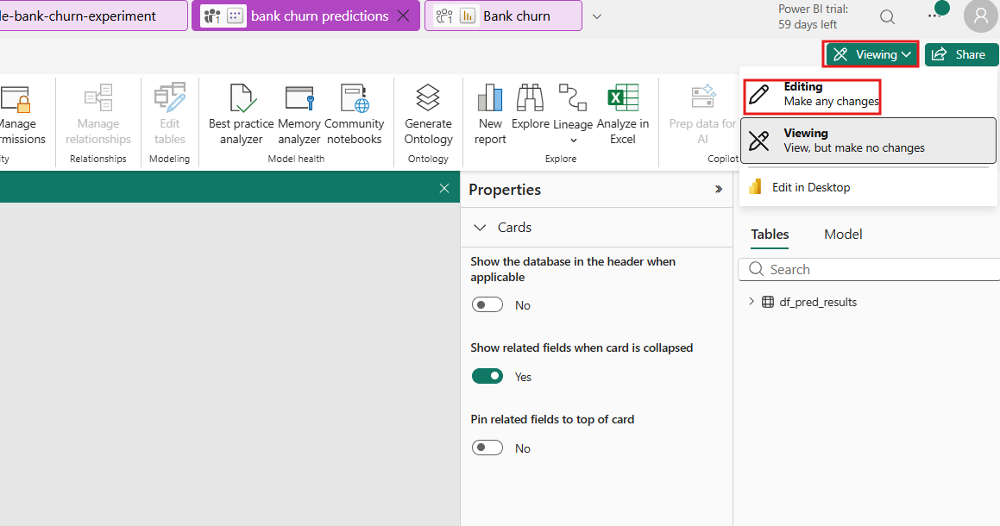

## Task 12: Add new measures

1.  Add a new measure for the churn rate.

    1.  Select **New measure** in the top ribbon. This action adds a new
        item named +++Measure+++ to
        the **customer_churn_test_predictions** dataset, and opens a
        formula bar above the table.

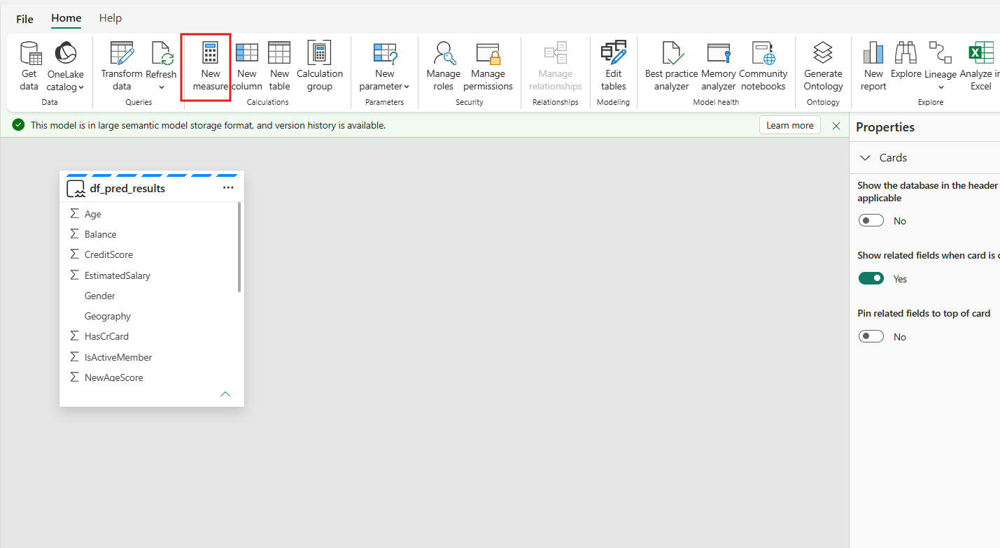

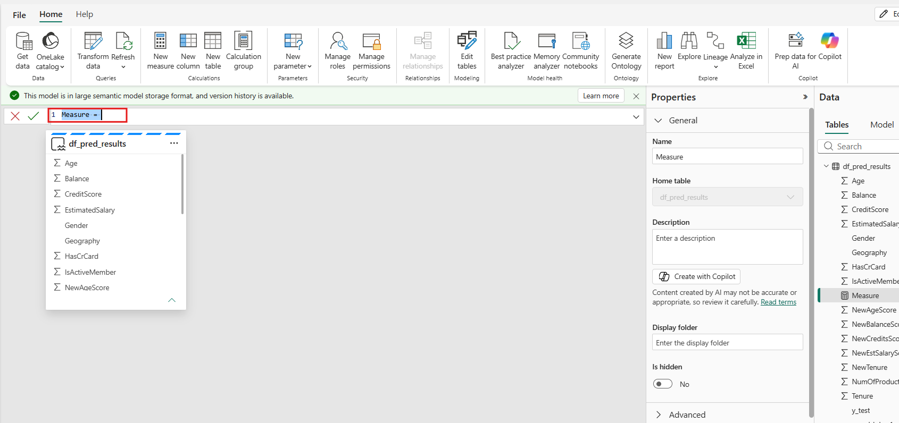

2.  To determine the average predicted churn rate, replace Measure = in
    the formula bar with:

+++Churn Rate = AVERAGE(df_pred_results[CreditScore])+++

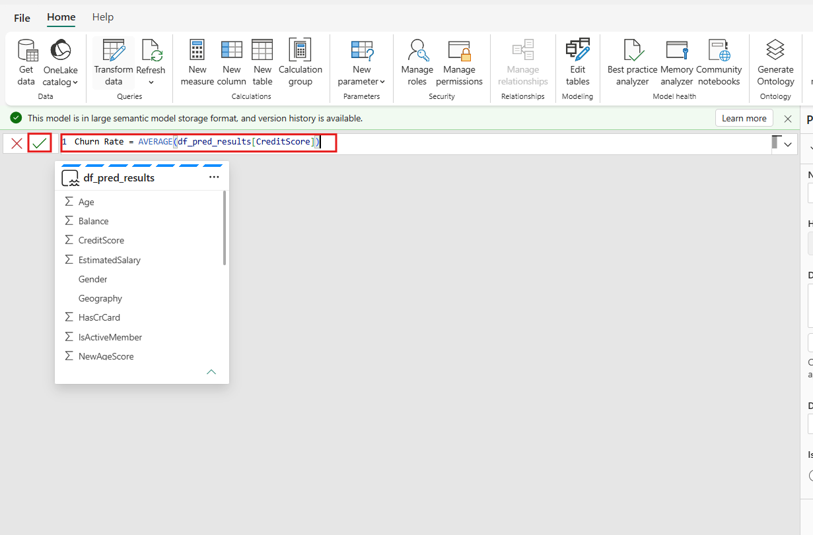

3.  To apply the formula, select the **check mark** in the formula bar.
    The new measure appears in the data table. The calculator icon shows
    it was created as a measure.


4.  Change the format from **General** to **Percentage** in
    the **Properties** panel.

5.  Scroll down in the **Properties** panel to change the **Decimal
    places** to 1.

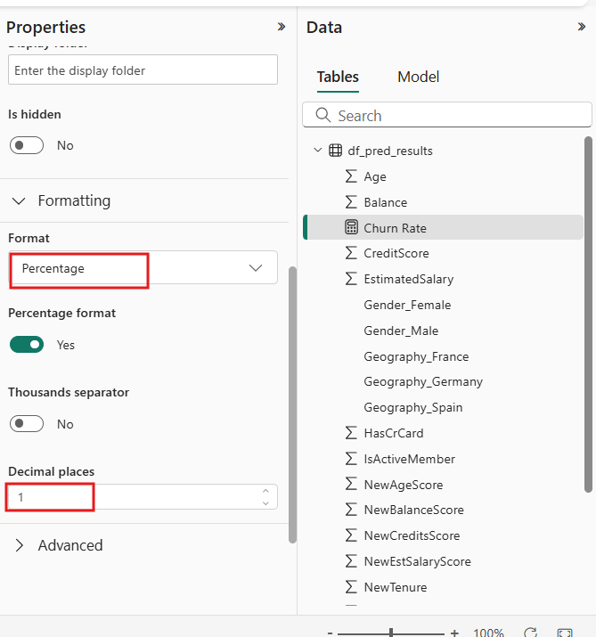

2.  Add a new measure that counts the total number of bank customers.
    You'll need it for the rest of the new measures.

    1.  Select **New measure** in the top ribbon to add a new item named
        +++Measure+++ to the customer_churn_test_predictions dataset.
        This action also opens a formula bar above the table.


2.  Each prediction represents one customer. To determine the total
    number of customers, replace Measure = in the formula bar with:

+++Customers = COUNT(df_pred_results[CreditScore])+++

3.  Select the **check mark** in the formula bar to apply the formula.


3.  Add the churn rate for Germany.

    1.  Select **New measure** in the top ribbon to add a new item named
        +++Measure+++ to the customer_churn_test_predictions dataset.
        This action also opens a formula bar above the table.


2.  To determine the churn rate for Germany, replace Measure = in the
    formula bar with:

```
Germany Churn = CALCULATE(
    [Churn Rate],
    df_pred_results[Geography_Germany] = 1
```

3.  To apply the formula, select the **check mark** in the formula bar.


This filters the rows down to the ones with Germany as their geography
(Geography_Germany equals one).

4.  Repeat the above step to add the churn rates for France and Spain.

    1.  **Spain's churn rate**: Select **New measure** in the top ribbon
        to add a new item named +++Measure+++ to the
        customer_churn_test_predictions dataset. This action also opens
        a formula bar above the table.


2.  Select the **check mark** in the formula bar to apply the formula

```
Spain Churn = CALCULATE(
    [Churn Rate],
    df_pred_results[Geography_Spain] = 1
)
```


5.  France's churn rate: Select **New measure** in the top ribbon to add
    a new item named +++Measure+++ to the
    customer_churn_test_predictions dataset. This action also opens a
    formula bar above the table.

6.  Select the **check mark** in the formula bar to apply the formula

```
France Churn = CALCULATE(
    [Churn Rate],
    df_pred_results[Geography_France] = 1
```

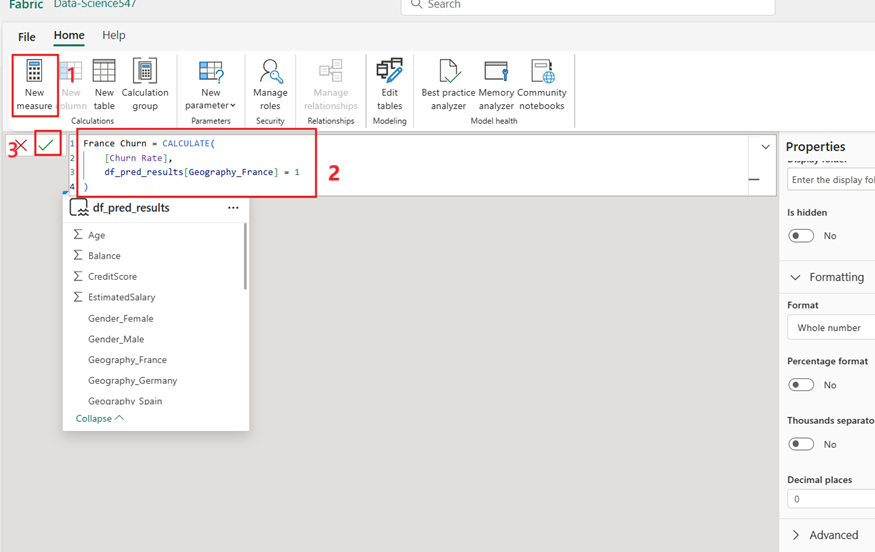

## Task 13: Create new report

1.  From the top ribbon, select **File** and select **New report** to
    start creating reports/dashboards in Power BI.


2.  In the Ribbon, select **Text box**. Type in +++**Bank Customer
    Churn+++**. **Highlight** the **text** Change the font size and
    background color in the Format panel. Adjust the font size and color
    by selecting the text and using the format bar.

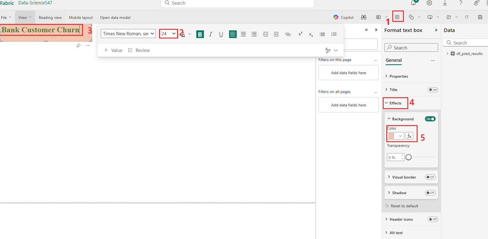


3.  In the Visualizations panel, select the **Card** icon. From
    the **Data** pane, select **Churn Rate**. Change the font size and
    background color in the Format panel. Drag this visualization to the
    top right of the report.


4.  In the Visualizations panel, select the **Line and stacked column
    chart** icon.

5.  The chart shows on the report. In the Data pane, select

    - Age

    - Churn Rate

    - Customers


6.  In the Visualizations panel, select the **Line and stacked column
    chart** icon. Select **NumOfProducts** for x-axis, **Churn
    Rate** for column y-axis, and **Customers** for the line y-axis.


7.  In the Visualizations panel, select the **Stacked column
    chart** icon. Select **NewCreditsScore** for x-axis and **Churn
    Rate** for y-axis.


8.  Change the title **NewCreditsScore** to **Credit Score** in the
    Format panel. Select **Format your visuals** and dropdown
    the **X-axis**, enter the Title text as +++Credit Score+++.

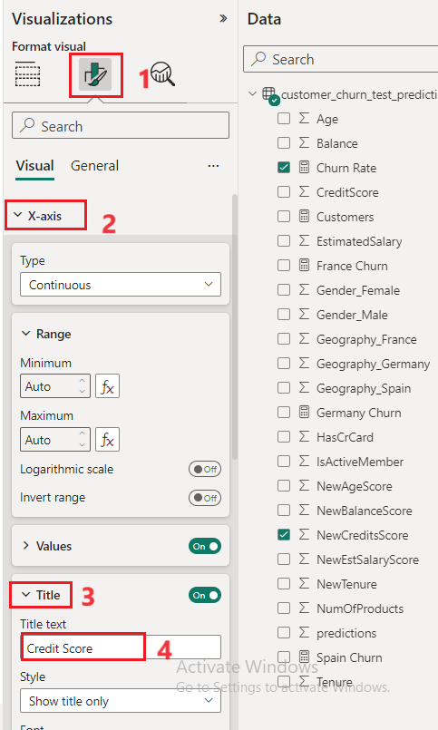

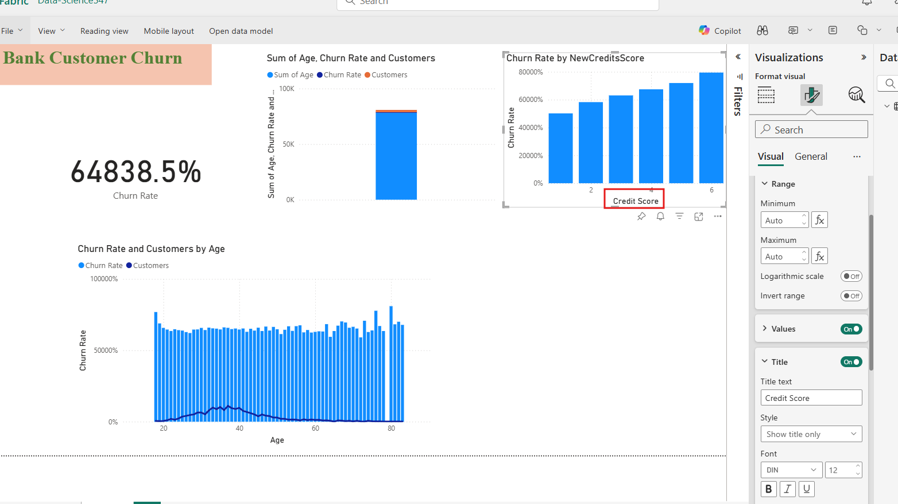

9.  From the ribbon, select **File** \> **Save**.

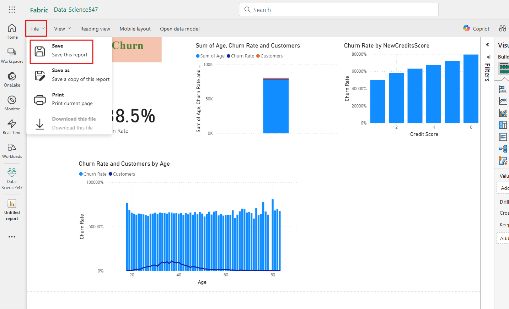

10. Enter the name of your report as **Bank churn Power BI report**.
    Select **Save**


The Power BI report shows:

- Customers who use more than two of the bank products have a higher
  churn rate although few customers had more than two products. The bank
  should collect more data, but also investigate other features
  correlated with more products (see the plot in the bottom left panel).

- Bank customers in Germany have a higher churn rate than in France and
  Spain (see the plot in the bottom right panel), which suggests that an
  investigation into what has encouraged customers to leave could be
  beneficial.

- There are more middle aged customers (between 25-45) and customers
  between 45-60 tend to exit more.

- Finally, customers with lower credit scores would most likely leave
  the bank for other financial institutes. The bank should look into
  ways that encourage customers with lower credit scores and account
  balances to stay with the bank.

## Task 14: Clean up resources

You can delete individual reports, pipelines, warehouses, and other
items or remove the entire workspace. Use the following steps to delete
the workspace you created for this tutorial.

1.  Select your workspace,
    the [**Data-Science@lab.LabInstance.IdX**](mailto:Data-Science@lab.LabInstance.IdX) from
    the left-hand navigation menu. It opens the workspace item view.

2.  Select the **...** option under the workspace name and
    select **Workspace settings**.

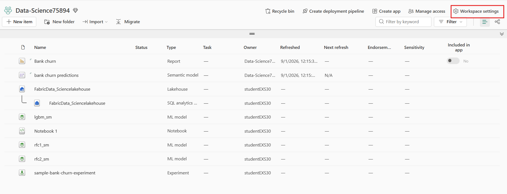

3.  Select **General tab** and **Remove this workspace.**


